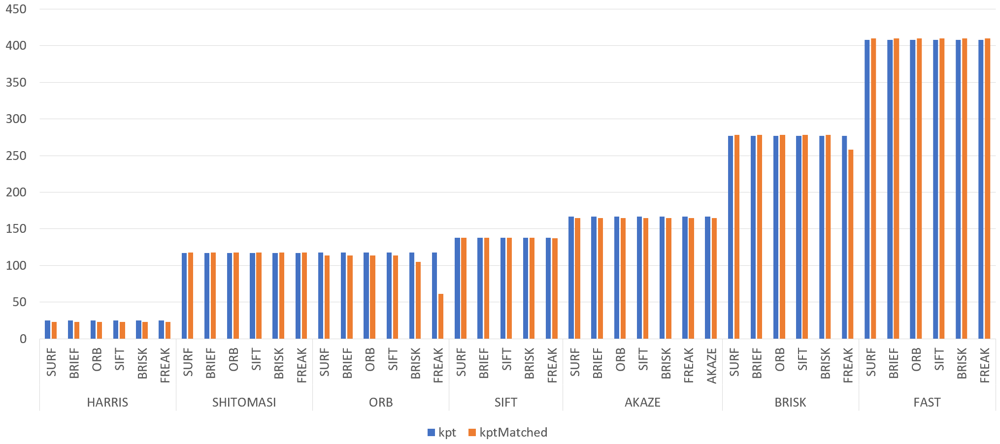
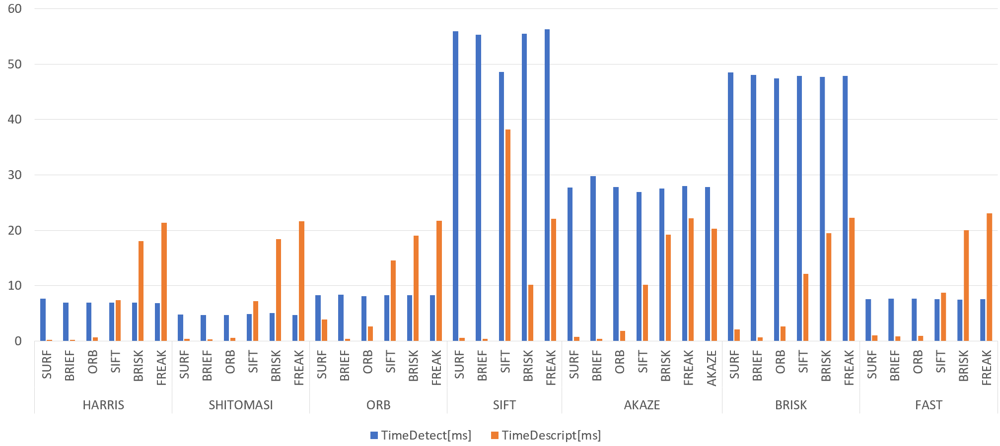

# SFND 2D Feature Tracking


The idea of the camera course is to build a collision detection system - that's the overall goal for the Final Project. As a preparation for this, you will now build the feature tracking part and test various detector / descriptor combinations to see which ones perform best. This mid-term project consists of four parts:

* First, you will focus on loading images, setting up data structures and putting everything into a ring buffer to optimize memory load. 
* Then, you will integrate several keypoint detectors such as HARRIS, FAST, BRISK and SIFT and compare them with regard to number of keypoints and speed. 
* In the next part, you will then focus on descriptor extraction and matching using brute force and also the FLANN approach we discussed in the previous lesson. 
* In the last part, once the code framework is complete, you will test the various algorithms in different combinations and compare them with regard to some performance measures. 

See the classroom instruction and code comments for more details on each of these parts. Once you are finished with this project, the keypoint matching part will be set up and you can proceed to the next lesson, where the focus is on integrating Lidar points and on object detection using deep-learning. 

## Dependencies for Running Locally
* cmake >= 2.8
  * All OSes: [click here for installation instructions](https://cmake.org/install/)
* make >= 4.1 (Linux, Mac), 3.81 (Windows)
  * Linux: make is installed by default on most Linux distros
  * Mac: [install Xcode command line tools to get make](https://developer.apple.com/xcode/features/)
  * Windows: [Click here for installation instructions](http://gnuwin32.sourceforge.net/packages/make.htm)
* OpenCV >= 4.1
  * This must be compiled from source using the `-D OPENCV_ENABLE_NONFREE=ON` cmake flag for testing the SIFT and SURF detectors.
  * The OpenCV 4.1.0 source code can be found [here](https://github.com/opencv/opencv/tree/4.1.0)
* gcc/g++ >= 5.4
  * Linux: gcc / g++ is installed by default on most Linux distros
  * Mac: same deal as make - [install Xcode command line tools](https://developer.apple.com/xcode/features/)
  * Windows: recommend using [MinGW](http://www.mingw.org/)

## Basic Build Instructions

1. Clone this repo.
2. Make a build directory in the top level directory: `mkdir build && cd build`
3. Compile: `cmake .. && make`
4. Run it: `./2D_feature_tracking`.

## Mid-Term Report

### TASK MP.1 -> replace the following code with ring buffer of size dataBufferSize
* I created a ring buffer like below.
```
dataBuffer[imgIndex % dataBufferSize] = frame;
```

### TASK MP.2 -> add the following keypoint detectors in file matching2D.cpp and enable string-based selection based on detectorTyp 
* Target Detector = HARRIS, FAST, BRISK, ORB, AKAZE, SIFT
* I modified the function "detKeypointsModern" like below.
* For example, I show the code of BRISK.
```
else if(detectorType == "BRISK")
{
    std::cout << "----> Call " << detectorType << std::endl;
    const int thresh  = 30;
    const int octaves = 3;
    const float patternScale = 1.0f;
    cv::Ptr<cv::BRISK> brisk = cv::BRISK::create(thresh, octaves, patternScale);
    brisk->detect(img, keypoints);
}
```

### TASK MP.3 -> only keep keypoints on the preceding vehicle
* I used cv::Rect::constains() to know wether the target point is in the rectangle. 
* I checked the number of the keypoints after erasing. 
```
bool bFocusOnVehicle = true;
cv::Rect vehicleRect(535, 180, 180, 150);
if (bFocusOnVehicle)
{
    cout << "before : keypoints size = " << keypoints.size() << endl;
    for(auto it = keypoints.begin(); it != keypoints.end(); ++it)
    {
        if(!vehicleRect.contains(it->pt))
        {
            keypoints.erase(it);
            it--;
        }
    }
    cout << "after  : keypoints size = " << keypoints.size() << endl;
}
```

### TASK MP.4 -> add the following descriptors in file matching2D.cpp and enable string-based selection based on descriptorType
* The target descriptor = BRIEF, ORB, FREAK, AKAZE, SIFT
* I modified the function "descKeypoints" like below.
* For example, I show the code of FREAK.
```
else if(descriptorType == "FREAK")
{
    extractor = cv::xfeatures2d::FREAK::create();
}
```

### TASK MP.5 -> add FLANN matching in file matching2D.cpp
* I modified "matchDescriptors" to create a matcher object for FLANN.
```
else if (matcherType.compare("MAT_FLANN") == 0)
{
    // Error Check : data type
    if((descSource.type() != CV_32F) || (descRef.type() != CV_32F))
    {
        descSource.convertTo(descSource, CV_32F);
        descRef.convertTo(descRef, CV_32F);
    }
    matcher = cv::DescriptorMatcher::create(cv::DescriptorMatcher::FLANNBASED);
}
```

### TASK MP.6 -> add KNN match selection and perform descriptor distance ratio filtering with t=0.8 in file matching2D.cpp
* I modified "matchDescriptors" like below.
```
else if (selectorType.compare("SEL_KNN") == 0)
{
    // k nearest neighbors (k=2)
    vector<vector<cv::DMatch>> knn_matches;
    int k = 2;
    matcher->knnMatch(descSource, descRef, knn_matches, k);

    // filter matchers using descriptor distance ratio
    double misDescDistRatio = 0.8;
    for(auto it = knn_matches.begin(); it != knn_matches.end(); ++it)
    {
        if((*it)[0].distance < misDescDistRatio * (*it)[1].distance)
        {
            matches.push_back((*it)[0]);
        }
    }
}  
```

### Results Analysis
- I show the number of keypoints.
- The ascend order is "HARRIS", "SHITOMASI", "ORB", "SIFT", "AKAZE", "BRISK", "FAST".



- I show the calculation times.





- I show the all detail results.

|Detector|Descriptor|kpt|kptMatched|TimeDetect[ms]|TimeDescript[ms]|
|:---:|:---:|:---:|:---:|:---:|:---:|
|HARRIS|SURF|25|23|7.67309|0.223901|
|HARRIS|BRIEF|25|23|6.9378|0.185246|
|HARRIS|ORB|25|23|6.91297|0.673746|
|HARRIS|SIFT|25|23|6.92127|7.35093|
|HARRIS|BRISK|25|23|6.96744|18.0063|
|HARRIS|FREAK|25|23|6.79758|21.3686|
|SHITOMASI|SURF|117|118|4.77273|0.418878|
|SHITOMASI|BRIEF|117|118|4.72828|0.297951|
|SHITOMASI|ORB|117|118|4.72674|0.585829|
|SHITOMASI|SIFT|117|118|4.89016|7.18128|
|SHITOMASI|BRISK|117|118|5.04847|18.4171|
|SHITOMASI|FREAK|117|118|4.66337|21.6021|
|ORB|SURF|118|114|8.30899|3.88362|
|ORB|BRIEF|118|114|8.32939|0.39536|
|ORB|ORB|118|114|8.13505|2.66694|
|ORB|SIFT|118|114|8.30058|14.5618|
|ORB|BRISK|118|105|8.26241|19.0068|
|ORB|FREAK|118|61|8.27055|21.7492|
|SIFT|SURF|138|138|55.9204|0.589394|
|SIFT|BRIEF|138|138|55.2958|0.415402|
|SIFT|SIFT|138|138|48.5633|38.1548|
|SIFT|BRISK|138|138|55.4639|10.1678|
|SIFT|FREAK|138|137|56.2605|22.0478|
|AKAZE|SURF|167|165|27.6916|0.732306|
|AKAZE|BRIEF|167|165|29.7287|0.433181|
|AKAZE|ORB|167|165|27.7905|1.83973|
|AKAZE|SIFT|167|165|26.9173|10.1603|
|AKAZE|BRISK|167|165|27.5532|19.1944|
|AKAZE|FREAK|167|165|28.0062|22.1502|
|AKAZE|AKAZE|167|165|27.7968|20.314|
|BRISK|SURF|277|278|48.5263|2.08094|
|BRISK|BRIEF|277|278|48.0622|0.669527|
|BRISK|ORB|277|278|47.4337|2.64937|
|BRISK|SIFT|277|278|47.859|12.1481|
|BRISK|BRISK|277|278|47.7256|19.4311|
|BRISK|FREAK|277|258|47.8706|22.2151|
|FAST|SURF|408|410|7.58899|1.01005|
|FAST|BRIEF|408|410|7.61393|0.832283|
|FAST|ORB|408|410|7.65166|0.910842|
|FAST|SIFT|408|410|7.59651|8.69477|
|FAST|BRISK|408|410|7.48284|20.0066|
|FAST|FREAK|408|410|7.54474|23.0903|
