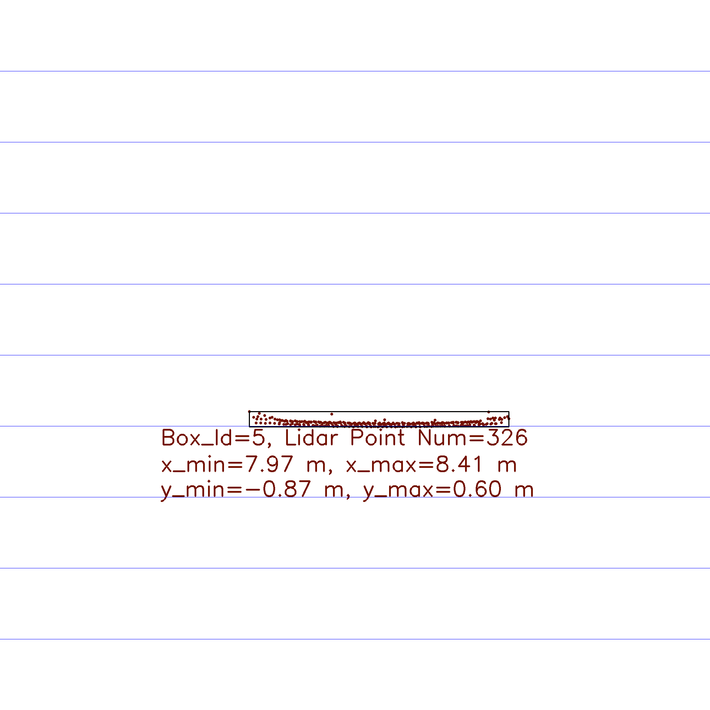
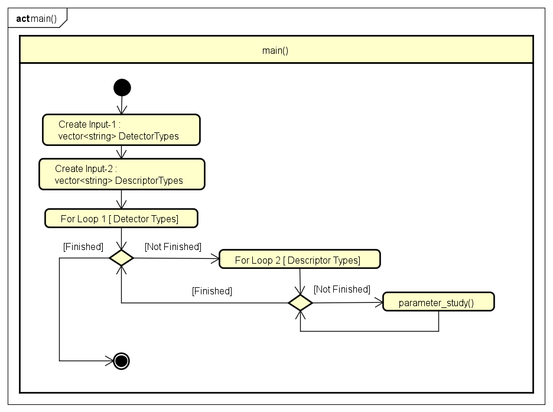
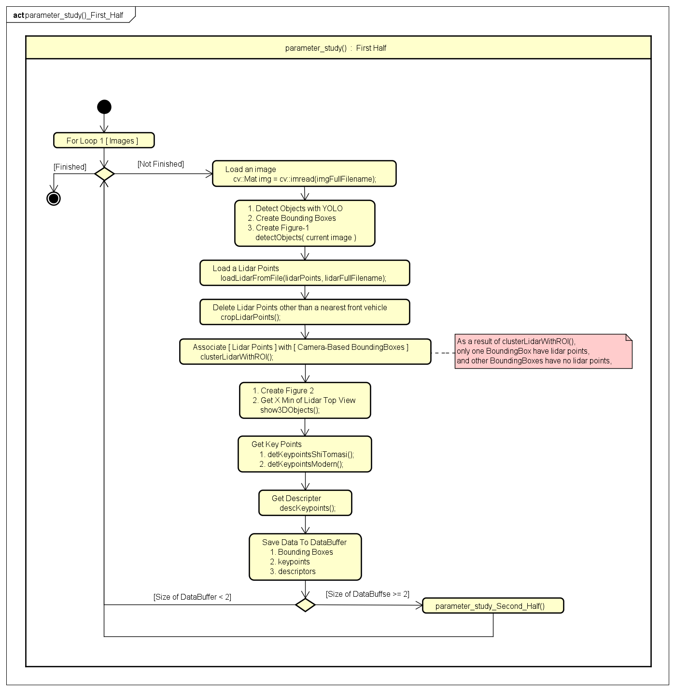
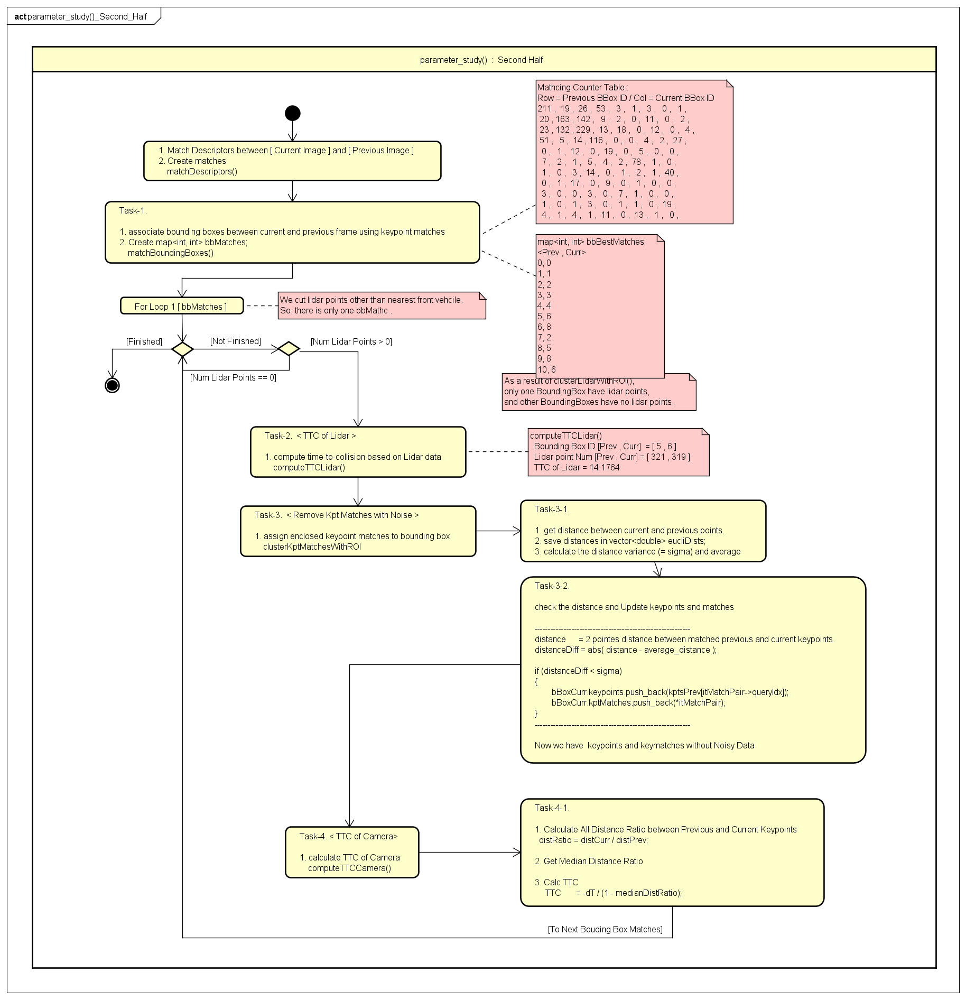
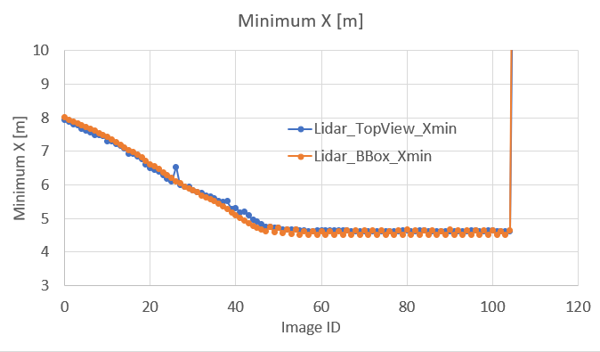
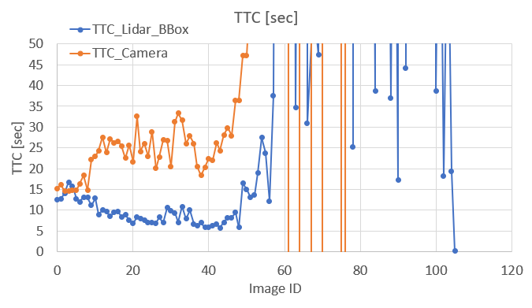
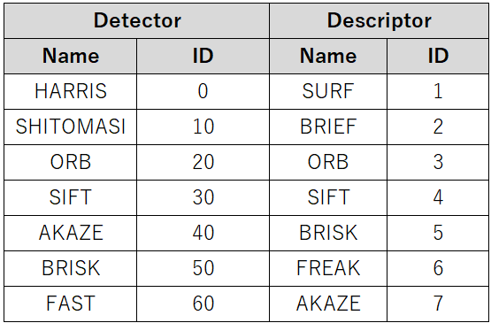
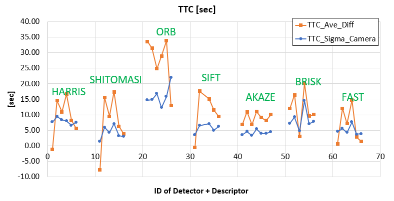

# SFND 3D Object Tracking

Welcome to the final project of the camera course. By completing all the lessons, you now have a solid understanding of keypoint detectors, descriptors, and methods to match them between successive images. Also, you know how to detect objects in an image using the YOLO deep-learning framework. And finally, you know how to associate regions in a camera image with Lidar points in 3D space. Let's take a look at our program schematic to see what we already have accomplished and what's still missing.

In this final project, you will implement the missing parts in the schematic. To do this, you will complete four major tasks: 
1. First, you will develop a way to match 3D objects over time by using keypoint correspondences. 
2. Second, you will compute the TTC based on Lidar measurements. 
3. You will then proceed to do the same using the camera, which requires to first associate keypoint matches to regions of interest and then to compute the TTC based on those matches. 
4. And lastly, you will conduct various tests with the framework. Your goal is to identify the most suitable detector/descriptor combination for TTC estimation and also to search for problems that can lead to faulty measurements by the camera or Lidar sensor. In the last course of this Nanodegree, you will learn about the Kalman filter, which is a great way to combine the two independent TTC measurements into an improved version which is much more reliable than a single sensor alone can be. But before we think about such things, let us focus on your final project in the camera course. 

## Dependencies for Running Locally
* cmake >= 2.8
  * All OSes: [click here for installation instructions](https://cmake.org/install/)
* make >= 4.1 (Linux, Mac), 3.81 (Windows)
  * Linux: make is installed by default on most Linux distros
  * Mac: [install Xcode command line tools to get make](https://developer.apple.com/xcode/features/)
  * Windows: [Click here for installation instructions](http://gnuwin32.sourceforge.net/packages/make.htm)
* OpenCV >= 4.1
  * This must be compiled from source using the `-D OPENCV_ENABLE_NONFREE=ON` cmake flag for testing the SIFT and SURF detectors.
  * The OpenCV 4.1.0 source code can be found [here](https://github.com/opencv/opencv/tree/4.1.0)
* gcc/g++ >= 5.4
  * Linux: gcc / g++ is installed by default on most Linux distros
  * Mac: same deal as make - [install Xcode command line tools](https://developer.apple.com/xcode/features/)
  * Windows: recommend using [MinGW](http://www.mingw.org/)

## Basic Build Instructions

1. Clone this repo.
2. Make a build directory in the top level project directory: `mkdir build && cd build`
3. Compile: `cmake .. && make`
4. Run it: `./3D_object_tracking`.

# FP1. to FP.4 (my solutions)
* I show the results of Object Tracking.
  
  

* I show my programs structure.

* main()

* parameter_study() : First half

* parameter_study() : Second half

# FP.5 Performance Evaluation 1(my solution)
* In "MyUtility.h", set "SIMULATION_TYPE" to "1" to get a result csv file.
* I show the minimum distance(X) of the nearest vehicle which is used to calculate TTC.
  * I show 2 types distance.
    1. distance which are calculated by Lidar-Top-View Points.
    2. distance which are calculated by Bounding Boxes Info.
    
* I show the TTC equation of the Constant Vecocity Model.
  * TTC = Relative_Distance / Relative_Velocity
    * Relative_Distance = Calculated_by_Lidar_Points 
    * Relative_Velocity = Relative_Distance_Change / Delta_Time
* For Image_ID 28, Relative_Distance_Change of TopView is not continuous.   TTC will not be continuous.
* After Image_ID 48, Relative_Distance_Change is too small. This will lead to unstable TTC calculation.

* I show the TTC which are calculated by Lidar Bounding Boxes Info.
  * For Image_ID 28, TTC changed suddenly.
  * After Image_ID 48, TTC become unstable.(from Image_ID 33 to 47, Relative_Distance_Change is gradually getting smaller)
  * In oder to compare results properly for FP.6, I use only Image_ID from 0 to 33.
  

# FP.6 Performance Evaluation 2(my solution)
* In "MyUtility.h", set "SIMULATION_TYPE" to "2" to get a result csv file.
* I give an index to each simulation type like below.
  * For example, if I use ORB Detector and SURF Descriptor, the id is becomes 21 (20+1).
  
* I show the TTC of Camera.
  * The orange line : (TTC Difference) = (TTC Average of Camera) - (TTC Average of Lidar).
  * The blue line : The variance of TTC of Camera.
  * If I suppose the results of Lidar are correct, the smaller the difference, the better the results of Camera are.
  * About Detectors, AKAZE(ID=40s) and FAST(ID=60s) is better.
  * About Descriptors, FREAK(ID=6) always leads to better result.
* So, I recommend that the AKAZE Detector and the FREAK Descriptor, because I want stable results.  
  
